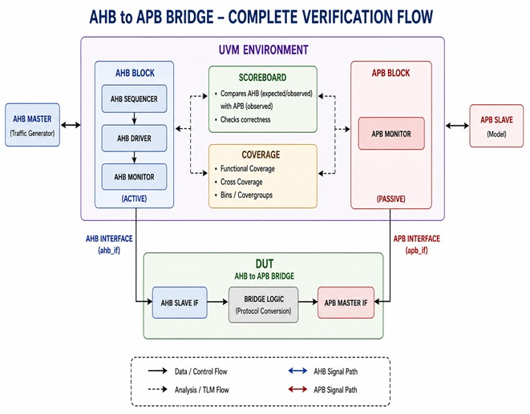
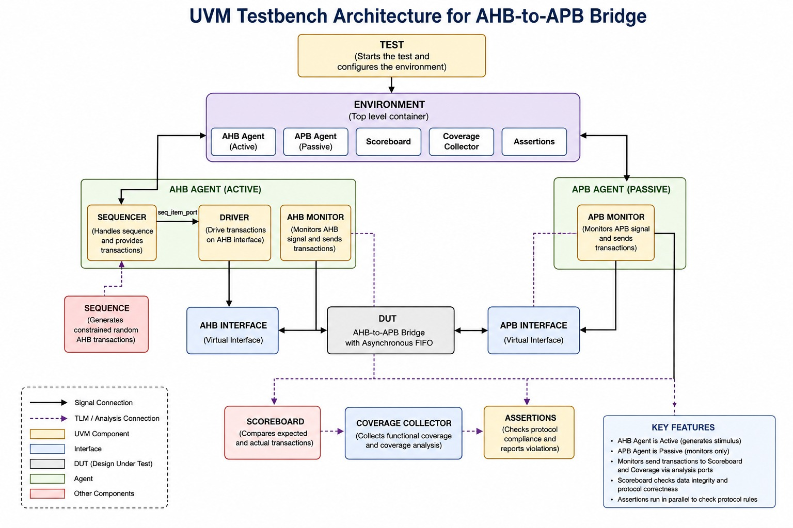

# Design and UVM-Based Verification of AMBA AHB-to-APB Bridge with Clock Domain Crossing (CDC)

A high-performance **AMBA AHB-to-APB Bridge** designed in **SystemVerilog** with support for **Clock Domain Crossing (CDC)** using an **Asynchronous FIFO**, and verified using a **Universal Verification Methodology (UVM)** based testbench.

The bridge interfaces a high-speed **AMBA AHB bus** with low-speed **AMBA APB peripherals**, enabling reliable communication between different clock domains while ensuring protocol compliance and data integrity.

---

## 📌 Project Overview

Modern SoCs frequently connect high-performance processors operating on the **AHB bus** with slower peripheral devices communicating over the **APB bus**. Since these buses often operate under different clock domains, reliable Clock Domain Crossing (CDC) becomes an essential design challenge.

This project implements an **AHB-to-APB Bridge** capable of handling asynchronous clock domains by integrating an **Asynchronous FIFO** between the AHB and APB interfaces. The design ensures safe transfer of address, data, and control information while preventing metastability.

To validate the functionality and protocol compliance, the complete RTL is verified using a **UVM-based verification environment**, covering write transactions, read transactions, wait-state handling, FIFO operations, and response synchronization across clock domains.

---

## ✨ Key Features

- AMBA AHB Slave Interface
- AMBA APB Master Interface
- Independent HCLK and PCLK Domains
- Clock Domain Crossing (CDC) Support
- Asynchronous FIFO using Gray Code Pointers
- Dual-Clock FIFO Architecture
- APB Controller Finite State Machine (FSM)
- Response Synchronizer for PCLK → HCLK Communication
- Parameterized RTL Design
- Support for Read and Write Transactions
- APB Wait-State Handling using PREADY
- PSLVERR Error Propagation
- Modular and Scalable Architecture
- UVM-Based Functional Verification
- Functional Coverage Collection
- Reusable Verification Components

---

# 🏗️ Project Architecture

The bridge is divided into two independent clock domains:

### HCLK Domain
- Receives transactions from the AHB Master.
- Captures address, data, and control signals.
- Pushes transactions into the Asynchronous FIFO.
- Receives synchronized read responses from the Response Synchronizer.
- Generates HRDATA, HRESP, and HREADYOUT.

### PCLK Domain
- Reads transactions from the FIFO.
- Generates APB control signals.
- Performs APB read/write operations.
- Captures PRDATA and PSLVERR.
- Sends responses back through the Response Synchronizer.

---


---

# 🔄 Complete Transaction Flow

The bridge supports both **AHB Write** and **AHB Read** transactions.

### Write Transaction

1. AHB Master initiates a write transaction.
2. AHB Interface captures the request.
3. Transaction is stored inside the Asynchronous FIFO.
4. APB Controller reads the FIFO entry.
5. APB write signals are generated.
6. Peripheral completes the write operation.

### Read Transaction

1. AHB Master initiates a read transaction.
2. Transaction is stored inside the FIFO.
3. APB Controller performs APB read.
4. Read data and response are captured.
5. Response Synchronizer safely transfers them to the HCLK domain.
6. AHB Interface returns HRDATA and HRESP to the master.


---

# ⚙️ APB Controller FSM

The APB Controller controls every APB transaction using a Finite State Machine.

### FSM States

| State | Description |
|--------|-------------|
| IDLE | Waits for a valid FIFO transaction |
| SETUP | Latches transaction and drives APB setup signals |
| ENABLE | Performs APB transfer and waits for PREADY |
| WAIT_RESP | Waits for response synchronization during read operations |
| DONE | Completes current transfer and checks for the next transaction |

The FSM supports:

- APB Setup Phase
- APB Enable Phase
- Wait-State Handling
- Read Data Capture
- Error Capture
- Continuous FIFO Processing


---

# 📦 Asynchronous FIFO (CDC Buffer)

The Asynchronous FIFO safely transfers transactions between the **HCLK** and **PCLK** domains.

### Features

- Dual Clock FIFO
- Independent Read/Write Clocks
- Gray Code Pointer Synchronization
- Binary Pointer Management
- Full Detection Logic
- Empty Detection Logic
- Two-Flip-Flop Synchronizers
- Safe Clock Domain Crossing

The FIFO eliminates metastability by synchronizing Gray-coded pointers between clock domains.


---

# 🔄 Response Synchronizer

The Response Synchronizer safely transfers APB responses back to the AHB clock domain.

### Responsibilities

- Captures Read Data
- Captures PSLVERR
- Generates Read Valid Pulse
- Toggle-Based Handshake
- Two-Flip-Flop Synchronizers
- Busy Signal Generation
- Safe Multi-bit Data Transfer

The handshake mechanism guarantees that every APB read response is transferred exactly once without data corruption.


---

# 🧩 RTL Module Description

The bridge is implemented using a modular RTL architecture. Each module performs a dedicated function, improving readability, scalability, and ease of verification.

| Module | Description |
|---------|-------------|
| **ahb_apb_pkg.sv** | Package containing shared parameters, typedefs, and transaction structures used throughout the design. |
| **ahb_interface.sv** | Implements the AHB slave interface, captures AHB transactions, writes requests into the asynchronous FIFO, and returns synchronized read responses to the AHB master. |
| **async_fifo.sv** | Dual-clock asynchronous FIFO used for Clock Domain Crossing (CDC) between HCLK and PCLK domains using Gray-coded pointers. |
| **apb_controller.sv** | Implements the APB controller FSM that reads transactions from the FIFO and generates APB protocol signals. |
| **response_synchronizer.sv** | Safely transfers read data, response status, and valid indication from the APB clock domain back to the AHB clock domain. |
| **ahb_apb_top.sv** | Top-level module integrating all RTL blocks into a complete AHB-to-APB bridge. |

---

# 🔍 UVM Verification Environment

The bridge is verified using a reusable **Universal Verification Methodology (UVM)** testbench designed to validate protocol compliance, functional correctness, and corner-case behavior.

### Verification Components

- Test
- Environment (env)
- AHB Agent
- APB Agent
- Driver
- Monitor
- Sequencer
- Sequences
- Scoreboard
- Functional Coverage
- Interface
- Top-Level Testbench

## Complete Verification Flow

The complete verification flow illustrates the interaction between the
AHB master, UVM environment, AHB-to-APB bridge, and APB slave model.

<p align="center">
  
</p>

## UVM Testbench Architecture

The UVM environment consists of an active AHB agent, passive APB agent,
scoreboard, functional coverage, assertions, and the DUT.

<p align="center">
  
</p>

# ✅ Verification Scenarios

The following functionality is verified using UVM sequences:

- AHB Write Transactions
- AHB Read Transactions
- Single Read and Write Transfers
- Consecutive Transactions
- FIFO Full Condition
- FIFO Empty Condition
- APB Wait-State Handling (PREADY)
- PSLVERR Response Handling
- Read Response Synchronization
- Clock Domain Crossing (CDC)
- Reset Functionality
- Boundary Address Verification

---

# 📊 Simulation Results

Simulation waveforms generated using **Siemens QuestaSim** verify the correct operation of the complete bridge.

The simulation demonstrates:

- Successful AHB Write Transactions
- Successful AHB Read Transactions
- Correct APB Signal Generation
- FIFO Read and Write Operations
- Proper Clock Domain Crossing
- Correct Read Response Synchronization
- Wait-State Handling using PREADY
- PSLVERR Propagation
- Functional Correctness of APB Controller FSM

Simulation waveforms are available in the **simulation/waveforms/** directory.

---

# 🛠️ Tools Used

| Tool | Purpose |
|------|---------|
| SystemVerilog | RTL Design |
| UVM | Functional Verification |
| Siemens QuestaSim | Simulation & Waveform Analysis |
| Git | Version Control |
| GitHub | Repository Management |

---

# 🚀 How to Run

Compile the RTL and UVM environment using your simulator.

Example QuestaSim flow:

```tcl
vlib work

vlog RTL/*.sv

vlog UVM/**/*.sv

vsim tb_top

run -all
```

After simulation, inspect the generated waveform and verify protocol correctness.

---

# 📈 Future Improvements

The current implementation provides a robust CDC-enabled bridge architecture. Future enhancements may include:

- Support for Multiple APB Slaves
- Address Decoder for Peripheral Selection
- Burst Transfer Support
- APB4 Protocol Extensions
- Enhanced Functional Coverage
- Assertion-Based Verification (SVA)
- Formal Verification
- Performance Optimization
- FPGA Prototyping

---
